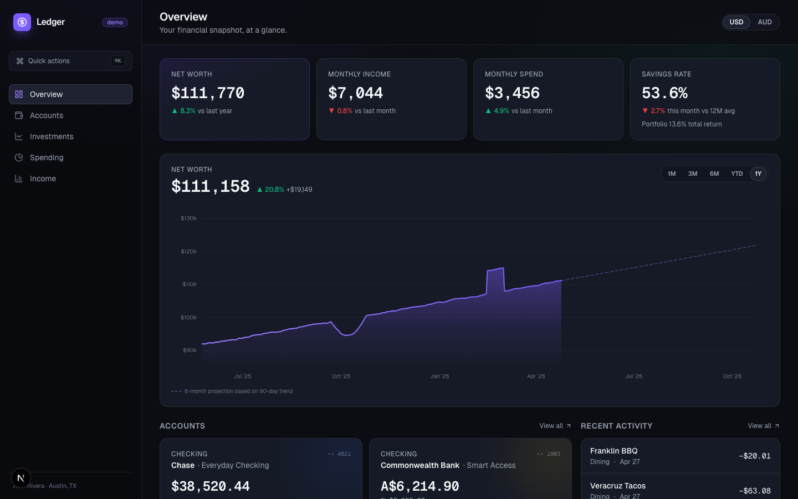

# Ledger — Personal Finance Dashboard

A modern, dark-themed personal finance dashboard built as a portfolio project. Net worth, multi-currency accounts, investment holdings, spending analytics, and savings-rate tracking — all wired together with realistic seeded mock data and production-grade architecture.

> **Live demo:** _`<deploy URL here>`_ · **Code:** this repo



---

## Why this exists

I wanted a portfolio piece that wasn't a todo app. The brief was simple — show a hiring manager "this person has shipped real frontend." So I picked a problem space (personal finance) that forces interesting architectural decisions: currency conversion, time-series data, async state, forms with optimistic updates, custom data visualisation, and opinionated design.

Every number on screen is mock data, but the architecture is production-shaped. Swapping the mock data service layer for a real API would be a one-file change per domain.

---

## What's in here

- **Overview** — KPI strip with count-up animations + a custom hand-rolled D3 net worth timeline (range selector, cursor-tracking tooltip, animated draw-in, respects `prefers-reduced-motion`)
- **Accounts** — US checking, Australian bank account, two investment accounts. FX conversion between USD and AUD with transparent rate footnote. Full transactions table with URL-persisted filters, sortable columns, and a dialog for adding transactions with optimistic updates
- **Investments** — Tabbed brokerage / Roth IRA view. Per-account allocation donut, holdings table with per-row 30-day sparklines, and performance charts with range selectors
- **Spending** — Current-month donut capped at 6 categories + "Other", 12-month stacked bar breakdown, top-5 merchants with magnitude bars, category drill-down to pre-filtered transactions
- **Income** — Income vs expenses bars with an average-savings reference line, savings rate area chart with a 40% FIRE target line, and a monthly cashflow table
- **Cmd+K command palette** — Navigate, toggle currency, jump to actions. Cmd/Ctrl+K anywhere
- **Responsive** — Sidebar collapses to a bottom nav under 1024px. Tables scroll horizontally on mobile; cards reflow single-column
- **Accessible** — Proper landmarks, focus rings, ARIA labels on charts, keyboard-navigable tabs and dialogs, reduced-motion respected
- **Tested** — 29 unit tests on the financial calculation layer (FX conversion, savings rate, portfolio aggregation, spending rollups)

---

## Architecture

```
app/
  (dashboard)/              Route group — sidebar + header shell
    overview/               KPI strip + hero D3 chart
    accounts/               Account cards + transactions table
    investments/            Brokerage + Roth tabs
    spending/               Donut + stacked bars
    income/                 Bars + savings rate + table
  layout.tsx                Providers (TanStack Query), fonts
components/
  charts/                   One custom D3 chart + Recharts compositions
  ui/                       Card, Button, Dialog, Tabs, Skeleton (no CLI tool, just the primitives I need)
  nav/, kpi/, accounts/, investments/, transactions/
lib/
  calc/                     Pure functions — all unit tested
    fx.ts, savings-rate.ts, portfolio.ts, spending.ts
  mock/                     Seeded mock data service — deterministic RNG
    accounts.ts, holdings.ts, transactions.ts, history.ts, fx.ts
  hooks/                    useDimensions, usePrefersReducedMotion
  stores/                   Zustand — display currency, density
```

### Three decisions worth calling out

**1. One custom D3 chart, everything else Recharts.**
Recharts is fast to ship and looks professional. But a dashboard that composes library charts doesn't prove much on its own. The Net Worth Timeline on the Overview page is hand-rolled — `d3-scale`, `d3-shape`, custom gradient defs, `strokeDasharray` animation on mount, a `bisector` for the hover crosshair. Everything else is Recharts, so I can move fast on secondary charts without over-engineering. See [`src/components/charts/net-worth-timeline.tsx`](src/components/charts/net-worth-timeline.tsx).

**2. Mock data as a service, not hardcoded arrays.**
Every mock module in `lib/mock/` exports `async` functions with an artificial latency. That forces real loading states (skeleton screens everywhere), lets TanStack Query cache/invalidate correctly, and — importantly — means replacing mock data with a real API is one file per domain, not a refactor. The transaction CRUD flow uses proper optimistic updates via `onMutate` / `onError` / `onSettled`, not a write-then-refetch stub.

**3. Dark-only, with restraint on glassmorphism.**
The brief called for dark + glassmorphism. Research (Mercury, Copilot Money, Linear, Arc) consistently showed that the current fintech aesthetic uses glassmorphism on one or two elevated surfaces only — command palette, modals, a summary card — not every panel. I defaulted the whole app to a solid `#0B0D12` base with hairline borders, and reserved `backdrop-blur` for the command palette and dialogs. Electric violet (`#7C5CFF`) as the sole accent.

---

## Tech stack

| Layer | Choice | Why |
|---|---|---|
| Framework | **Next.js 16** (App Router) + TypeScript strict | Current, first-class typed route props, Turbopack dev |
| Styling | **Tailwind CSS v4** (CSS-first tokens via `@theme`) | No config file needed — tokens live in `globals.css` |
| UI primitives | **Radix UI** + handwritten wrappers | Full a11y on Dialog and Tabs, not npm-install-and-forget |
| Charts | **Custom D3** for the hero, **Recharts** for everything else | One hard thing + speed for the rest |
| Server state | **TanStack Query v5** | Cache, invalidation, optimistic updates, one cache key per domain |
| Client state | **Zustand** with `persist` middleware | Currency/density preferences persist to localStorage |
| Forms | **React Hook Form + Zod** | Type-safe end-to-end |
| Animation | **Framer Motion** (sparingly) + **react-countup** | Purposeful motion, not decoration |
| Command palette | **cmdk** | Cmd+K pattern that every modern product ships |
| Testing | **Vitest** + **@testing-library** | Fast, ESM-first |

---

## Mock persona

The data models a 29-year-old software engineer in Austin, Texas with ~$115K annual salary, a stint working in Melbourne (hence the AUD account), and a ~48% savings rate trajectory. History includes a realistic market dip around month 5 and a Q4 bonus spike in month 10 — so the Net Worth chart has something interesting to show. Full persona config lives in [`src/lib/mock/persona.ts`](src/lib/mock/persona.ts).

No real financial data is used. The RNG is seeded (`mulberry32`), so the dataset is byte-for-byte identical on every load — which makes screenshots stable for demos.

---

## Tradeoffs I made (and why)

- **Recharts over Visx or pure D3 for secondary charts.** Visx gives more control but ships ~3× more bundle. For this project, Recharts' defaults after 10 minutes of theming looked fintech-shipped. The one custom D3 chart is the differentiator.
- **No light mode.** Mercury, Copilot Money, Ramp all ship dark-first. Supporting a light theme would double the design surface and add a toggle nobody would flip. The project makes a strong visual choice and commits.
- **No real backend.** Adding an API would have turned a two-week portfolio piece into a one-month "personal finance SaaS." The mock service layer is designed so a real API could replace it per-domain without refactoring consumers.
- **Transactions persist only for the session.** In-memory mock store resets on reload. This is the right tradeoff for a demo — no backend required, optimistic update flow is still fully exercised.
- **E2E tests deferred.** Unit tests cover the pure calculation layer (where most real bugs live). A Playwright E2E would be the natural next addition.

---

## What's next

- Monarch-style Sankey diagram on the Income page (income flows → categories + savings + investments)
- CSV import with AI transaction categorisation (OpenAI function-calling on upload)
- Real Plaid sandbox integration as a proof-of-concept
- Playwright happy-path E2E (load → add transaction → verify it appears on overview)
- Lighthouse + axe DevTools CI pass for every PR

---

## Running locally

```bash
npm install
npm run dev          # http://localhost:3000
npm run build        # production build, typecheck
npm test             # 29 unit tests (calc layer)
```

Requires Node 20+ (tested on Node 25 with Next.js 16).

---

## Project structure note

The UI primitives in `components/ui/` are hand-written Radix wrappers, not generated via a CLI. Each file is small, explicit, and themed to this project's tokens — easier to reason about than pulling in a component library wholesale.

---

_Built in 2026 · Dark theme because the terminal was right · All data is mock._
